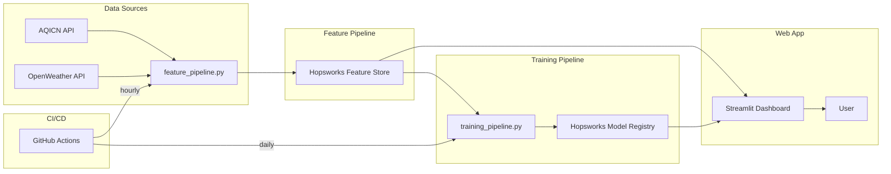

# Pearls AQI Predictor — Implementation Plan

Predict the Air Quality Index (AQI) for the next 3 days using a 100% serverless stack with automated data collection, ML training, and a real-time web dashboard.

---

## High-Level Architecture



---

## Proposed Project Structure

```
AQI_Predictor/
├── .github/
│   └── workflows/
│       ├── feature_pipeline.yml        # Hourly feature ingestion
│       └── training_pipeline.yml       # Daily model retraining
├── data/
│   └── backfill/                       # Cached backfill CSVs (gitignored)
├── notebooks/
│   ├── 01_eda.ipynb                    # Exploratory Data Analysis
│   ├── 02_model_experiments.ipynb      # Model comparison notebook
│   └── 03_shap_analysis.ipynb         # SHAP explainability
├── src/
│   ├── __init__.py
│   ├── config.py                       # API keys, Hopsworks config, city list
│   ├── feature_pipeline.py            # Fetch → compute → store features
│   ├── backfill.py                    # Historical data backfill script
│   ├── training_pipeline.py           # Train → evaluate → register model
│   ├── inference.py                   # Load model & predict next 3 days
│   └── utils.py                       # Shared helpers (API calls, feature eng.)
├── app/
│   ├── streamlit_app.py               # Main Streamlit dashboard
│   ├── flask_api.py                   # Flask REST API for predictions
│   └── assets/                        # Dashboard images/styles
├── tests/
│   ├── test_feature_pipeline.py
│   ├── test_training_pipeline.py
│   └── test_inference.py
├── requirements.txt
├── .env.example                       # Template for API keys
├── .gitignore
├── README.md
└── main.py                            # CLI entry point
```

---

## Technology Choices

| Layer | Tool | Rationale |
|-------|------|-----------|
| **Data APIs** | AQICN + OpenWeatherMap | AQICN gives real-time AQI & pollutants; OpenWeather provides weather context (temp, humidity, wind). Both have free tiers. |
| **Feature Store** | Hopsworks (free tier) | Purpose-built ML feature store with versioning, time-travel, and a model registry — all free for serverless tier. |
| **ML Models** | Scikit-learn + XGBoost | Scikit-learn for baselines (Random Forest, Ridge); XGBoost for gradient boosting. |
| **Explainability** | SHAP | Works with both sklearn and TF models; generates intuitive feature importance plots. |
| **CI/CD** | GitHub Actions | Free, zero-infrastructure, cron-capable workflows. |
| **Dashboard** | Streamlit | Fast prototyping of interactive ML dashboards with charts and maps. |
| **API** | Flask | Lightweight REST API to serve predictions programmatically. |

---

## Phase-by-Phase Plan

### Phase 1: Project Setup & Configuration
> **Goal**: Set up the repository, install dependencies, and configure API access.

#### [NEW] [requirements.txt](file:///c:/Users/user/Desktop/AQI_Predictor/requirements.txt)
- Core: `pandas`, `numpy`, `scikit-learn`, `xgboost`, `hopsworks`
- Data: `requests`, `python-dotenv`
- Explainability: `shap`
- Viz: `matplotlib`, `seaborn`, `plotly`
- Web: `streamlit`, `flask`
- Testing: `pytest`

#### [NEW] [.env.example](file:///c:/Users/user/Desktop/AQI_Predictor/.env.example)
- `AQICN_API_KEY` — from https://aqicn.org/data-platform/token/
- `OPENWEATHER_API_KEY` — from https://openweathermap.org/api
- `HOPSWORKS_API_KEY` — from https://app.hopsworks.ai/
- `CITY` — target city (e.g., `lahore` or `karachi`)

#### [NEW] [src/config.py](file:///c:/Users/user/Desktop/AQI_Predictor/src/config.py)
- Load environment variables
- Define constants: `FEATURE_GROUP_NAME`, `FEATURE_GROUP_VERSION`, `MODEL_NAME`
- City coordinates mapping

#### Tasks:
- [ ] Register for AQICN API token
- [ ] Register for OpenWeatherMap API key
- [ ] Create free Hopsworks account & get API key
- [ ] Create virtual environment & install dependencies
- [ ] Initialize git repository

---

### Phase 2: Feature Pipeline Development
> **Goal**: Fetch real-time air quality & weather data, engineer features, store in Hopsworks.

#### [NEW] [src/utils.py](file:///c:/Users/user/Desktop/AQI_Predictor/src/utils.py)
- `fetch_aqicn_data(city)` → returns pollutant concentrations (PM2.5, PM10, O3, NO2, SO2, CO) and current AQI
- `fetch_openweather_data(lat, lon)` → returns temperature, humidity, wind speed, pressure, weather description
- `compute_features(raw_data)` → engineers the following features:
  - **Time features**: hour, day_of_week, month, is_weekend, season
  - **Pollutant features**: PM2.5, PM10, O3, NO2, SO2, CO
  - **Weather features**: temperature, humidity, wind_speed, pressure
  - **Derived features**: AQI change rate, rolling averages (3h, 6h, 12h, 24h), pollutant ratios
- `compute_aqi_target(pollutant_data)` → computes AQI using EPA breakpoints (if needed)

#### [NEW] [src/feature_pipeline.py](file:///c:/Users/user/Desktop/AQI_Predictor/src/feature_pipeline.py)
1. Call `fetch_aqicn_data()` and `fetch_openweather_data()`
2. Merge raw data into a single DataFrame
3. Call `compute_features()` to engineer model inputs
4. Define target: AQI for t+24h, t+48h, t+72h (next 3 days)
5. Connect to Hopsworks Feature Store
6. Insert feature row into the Feature Group (with event timestamp)

> [!IMPORTANT]
> **API Rate Limits**: AQICN free tier allows ~1000 calls/day. OpenWeather free tier allows 1000 calls/day. Running hourly (24 calls/day) is well within limits.

---

### Phase 3: Historical Data Backfill
> **Goal**: Generate training data by backfilling features for past dates.

#### [NEW] [src/backfill.py](file:///c:/Users/user/Desktop/AQI_Predictor/src/backfill.py)
- Strategy 1: Use OpenWeather's **historical weather API** (One Call 3.0 with timemachine) for past weather data
- Strategy 2: Use AQICN's historical data (if available) or alternative sources like OpenAQ
- Loop through past 90–180 days, fetch data, compute features, and bulk insert into Hopsworks
- Save a local CSV backup in `data/backfill/` for reproducibility
- Include progress bars and error handling for long-running backfill

> [!WARNING]
> **Historical AQI data availability**: AQICN's free API may not provide historical data. We may need to use **OpenAQ** (open-source air quality data) as a supplementary source, or use the World Air Quality Index historical data dumps. I will explore all options during implementation.

---

### Phase 4: Exploratory Data Analysis (EDA)
> **Goal**: Understand data distributions, correlations, and seasonal patterns.

#### [NEW] [notebooks/01_eda.ipynb](file:///c:/Users/user/Desktop/AQI_Predictor/notebooks/01_eda.ipynb)
- Time series plots of AQI over time
- Correlation heatmap (pollutants vs AQI, weather vs AQI)
- Seasonal decomposition
- Distribution analysis of each feature
- Missing data analysis
- AQI category distribution (Good / Moderate / Unhealthy / Hazardous)
- Hourly & daily AQI pattern analysis

---

### Phase 5: Training Pipeline
> **Goal**: Train multiple models, evaluate them, and register the best one.

#### [NEW] [src/training_pipeline.py](file:///c:/Users/user/Desktop/AQI_Predictor/src/training_pipeline.py)

**Step 1 — Data Preparation**:
- Fetch features and targets from Hopsworks Feature Store
- Train/validation/test split (70/15/15, respecting temporal order)
- Feature scaling (StandardScaler or MinMaxScaler)

**Step 2 — Model Training** (multiple models):

| Model | Type | Notes |
|-------|------|-------|
| Ridge Regression | Baseline | Simple linear baseline |
| Random Forest | Ensemble | Good for tabular data, handles non-linearity |
| XGBoost / Gradient Boosting | Ensemble | Often top performer for tabular data |


**Step 3 — Evaluation**:
- Metrics: **RMSE**, **MAE**, **R²** for each model
- Cross-validation with time-series split (no data leakage)
- Comparison table & visualization

**Step 4 — Model Registry**:
- Register best model in Hopsworks Model Registry
- Save model metadata (metrics, hyperparameters, training date)
- Version models for rollback capability

#### [NEW] [notebooks/02_model_experiments.ipynb](file:///c:/Users/user/Desktop/AQI_Predictor/notebooks/02_model_experiments.ipynb)
- Hyperparameter tuning experiments
- Learning curves
- Residual analysis
- Model comparison charts

---

### Phase 6: Advanced Analytics & Explainability
> **Goal**: Use SHAP for feature importance, add AQI hazard alerts.

#### [NEW] [notebooks/03_shap_analysis.ipynb](file:///c:/Users/user/Desktop/AQI_Predictor/notebooks/03_shap_analysis.ipynb)
- SHAP summary plots (global feature importance)
- SHAP force plots (individual prediction explanations)
- SHAP dependence plots (feature interactions)
- Comparison of feature importance across models

#### Alert System (integrated into dashboard):
- AQI > 100 → **Unhealthy for Sensitive Groups** (yellow alert)
- AQI > 150 → **Unhealthy** (orange alert)
- AQI > 200 → **Very Unhealthy** (red alert)
- AQI > 300 → **Hazardous** (maroon alert with urgent notification)

---

### Phase 7: Web Application Dashboard
> **Goal**: Build an interactive dashboard showing real-time & forecasted AQI.

#### [NEW] [app/streamlit_app.py](file:///c:/Users/user/Desktop/AQI_Predictor/app/streamlit_app.py)
- **Header**: City name, current date/time, current AQI with color-coded badge
- **3-Day Forecast Section**: Line chart showing predicted AQI for next 72 hours
- **Current Conditions**: Cards showing temperature, humidity, wind, pollutant levels
- **Feature Importance**: SHAP waterfall chart for the current prediction
- **Historical Trends**: Interactive time-series chart (last 7/30/90 days)
- **AQI Health Alert Banner**: Dynamic alert based on predicted AQI levels
- **Model Performance**: Display model metrics (RMSE, MAE, R²)

#### [NEW] [app/flask_api.py](file:///c:/Users/user/Desktop/AQI_Predictor/app/flask_api.py)
- `GET /api/predict` → returns 3-day AQI forecast as JSON
- `GET /api/current` → returns current AQI & conditions
- `GET /api/history?days=N` → returns historical AQI data
- `GET /api/health` → health check endpoint

#### [NEW] [src/inference.py](file:///c:/Users/user/Desktop/AQI_Predictor/src/inference.py)
- Load latest model from Hopsworks Model Registry
- Load latest features from Feature Store
- Generate predictions for t+24h, t+48h, t+72h
- Return predictions with confidence intervals

---

### Phase 8: CI/CD Automation with GitHub Actions
> **Goal**: Automate feature ingestion (hourly) and model retraining (daily).

#### [NEW] [.github/workflows/feature_pipeline.yml](file:///c:/Users/user/Desktop/AQI_Predictor/.github/workflows/feature_pipeline.yml)
```yaml
# Runs every hour
schedule:
  - cron: '0 * * * *'  # Every hour at minute 0
```
- Checkout repo → install deps → run `src/feature_pipeline.py`
- Secrets: `AQICN_API_KEY`, `OPENWEATHER_API_KEY`, `HOPSWORKS_API_KEY`

#### [NEW] [.github/workflows/training_pipeline.yml](file:///c:/Users/user/Desktop/AQI_Predictor/.github/workflows/training_pipeline.yml)
```yaml
# Runs every day at midnight
schedule:
  - cron: '0 0 * * *'  # Daily at 00:00 UTC
```
- Checkout repo → install deps → run `src/training_pipeline.py`
- Upload training metrics as workflow artifacts

---

## User Review Required

> [!IMPORTANT]
> **City Selection**: Which city/cities do you want to predict AQI for? This affects API configuration and backfill strategy. (e.g., Lahore, Karachi, Islamabad, or a non-Pakistan city?)

> [!IMPORTANT]
> **Hopsworks vs Vertex AI**: I recommend **Hopsworks** (free serverless tier) as it provides both a Feature Store and Model Registry in one platform. Vertex AI would require a Google Cloud account with billing. Do you agree with Hopsworks?

> [!IMPORTANT]
> **Streamlit deployment**: For the final dashboard, do you want to deploy on **Streamlit Community Cloud** (free), or keep it local-only for now?

## Open Questions

1. **Target city**: Which city should we start with? (I'll set up the config to support multiple cities later)
2. **Historical data depth**: How far back should we backfill? I suggest 90–180 days for a good training set.
3. *(Removed — deep learning models not required for current scope)*
4. **Report format**: The project mentions a "detailed report" — should this be a PDF, a Jupyter notebook, or a markdown document?

---

## Execution Order (Step by Step)

| Step | Phase | Description | Dependencies |
|------|-------|-------------|--------------|
| 1 | Phase 1 | Project setup, API keys, Hopsworks account | None |
| 2 | Phase 2 | Feature pipeline (fetch → compute → store) | Step 1 |
| 3 | Phase 3 | Historical backfill | Step 2 |
| 4 | Phase 4 | EDA notebook | Step 3 |
| 5 | Phase 5 | Training pipeline (all models) | Step 3 |
| 6 | Phase 6 | SHAP analysis & alerts | Step 5 |
| 7 | Phase 7 | Streamlit dashboard & Flask API | Steps 5, 6 |
| 8 | Phase 8 | GitHub Actions CI/CD | Steps 2, 5 |
| 9 | — | Final report & documentation | All |

---

## Verification Plan

### Automated Tests
- `pytest tests/` — unit tests for feature engineering, API parsing, inference
- Validate feature pipeline produces correct schema
- Validate model metrics meet minimum thresholds (R² > 0.5, RMSE reasonable for AQI scale)

### Manual Verification
- Run feature pipeline manually and verify data appears in Hopsworks UI
- Check Streamlit dashboard renders correctly with live data
- Verify GitHub Actions workflows trigger on schedule
- Test Flask API endpoints with curl/Postman
- Validate SHAP plots render for all model types

### Integration Tests
- End-to-end: fetch data → store features → train model → inference → dashboard display
- Verify model predictions are in valid AQI range (0–500)
